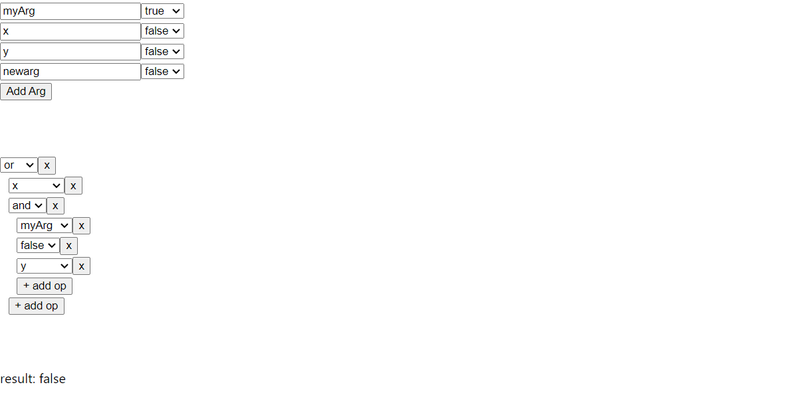

<h1 align="center">Logic Flow and Evaluation app in React.JS</h1>

## Demo
https://logical-flow.vercel.app/
<p align="center">
  
</p>


## About
This is a simple web application built with React that allows users to create a logic flow and it gives the final result of that input logical expression.


## Features
- Generat or modify arguments.
- Generat a logic flow using constant, argument, operators such as "and", "or".
- Get the final result


## Getting started
To get started with the app, you can follow these steps:
``` bash
# Clone this project
$ git clone https://github.com/apurbar06/logical-flow
# Access
$ cd logical-flow
# Install the necessary dependencies
$ npm install
# Start the development server
$ npm start
# Test
$ npm test
```
The app should now be running on http://localhost:3000.


